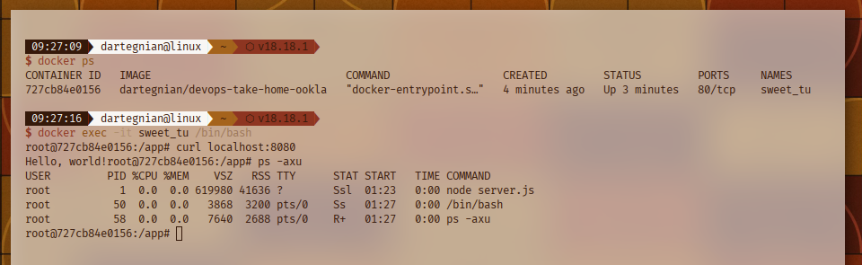
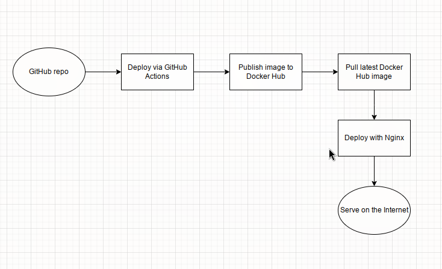

## Ookla DevOps Engineer Take-Home Assignment

### Proof of work

https://ookla-test.dartegnian.com/




### Deployment plan
- Initial fork of repository
- Set up GitHub Actions YML file for Docker
- Set up GitHub Actions environment and secrets
- Deploy to Docker Hub (https://hub.docker.com/r/dartegnian/devops-take-home-ookla)
- Pull latest image to machine (my Linux server)
- Serve with Nginx




### Nginx config

```
server {
  server_name ookla-test.dartegnian.com;

  location / {
    proxy_set_header Host $http_host;
    proxy_set_header X-Real-IP $remote_addr;
    proxy_set_header X-Scheme $scheme;
    proxy_set_header X-Forwarded-Proto $scheme;
    proxy_set_header X-Forwarded-For $proxy_add_x_forwarded_for;
    proxy_redirect off;
    proxy_pass http://localhost:8080/;
  }


    listen 443 ssl; # managed by Certbot
    ssl_certificate /etc/letsencrypt/live/ookla-test.dartegnian.com/fullchain.pem; # managed by Certbot
    ssl_certificate_key /etc/letsencrypt/live/ookla-test.dartegnian.com/privkey.pem; # managed by Certbot
    include /etc/letsencrypt/options-ssl-nginx.conf; # managed by Certbot
    ssl_dhparam /etc/letsencrypt/ssl-dhparams.pem; # managed by Certbot

}
server {
    if ($host = ookla-test.dartegnian.com) {
        return 301 https://$host$request_uri;
    } # managed by Certbot


  server_name ookla-test.dartegnian.com;
    listen 80;
    return 404; # managed by Certbot


}
```

### Original

Below is a take-home assignment before the interview for the position. You are required to:
1. Understand the situation and use case. You may contact the interviewer for further clarification.
2. Develop and run your deployment plan using your preferred tools.
3. Set up a Github workflow to build the application via CI. 
4. Bring your deployment, outputs, and result to the next interview session.

### Situation
One of the development teams has set up a initial "Hello World" Node application but is running into issues getting it to build via our CI tools. Troubleshoot the following application, make any changes necessary to get it to run, and optimize as you see fit.

### Free Resources
You may use the following free resources for your deployment:
- https://github.com/features/codespaces
- https://www.heroku.com/
- https://www.netlify.com/
- https://vercel.com/

### Requirement
Your deployment must meet the following criteria:
- Documentation for the deployment plan, including any updates you need to make to the repository
- A working front end which is reachable through internet
- Evidence of a working build pipeline
- Evidence of any required infrastructure

### Tips on completing this assignment
- Use the best tools you have on hand.
- This assignment should take no more than 3 hours.
- Communicate effectively like you are going to communicate with the actual team member.
